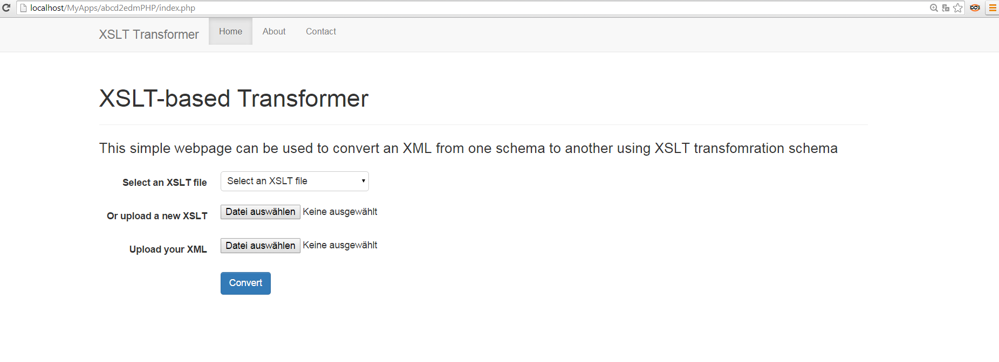

# XSLTransformer
Simple PHP application for transforming XML files from one schema to another using XSLT.
To use the application, deploy it in your server root directory and type [http://localhost/MyApps/abcd2edmPHP/](http://localhost/MyApps/abcd2edmPHP/) in your browser. 

At the home page you can upload an *XSLT* transformation schema or choose an exisiting one. Next, upload the *XML* file which you you want to convert. See the screenshot below:

By clicking the convert button the source XML is converted and a screen apears where you can download/view the converted file, in addition to the source XML and XSLT files (See below):

To test the application, sample XML and XSLT files are provied in the [Examples](examples/) folder.
